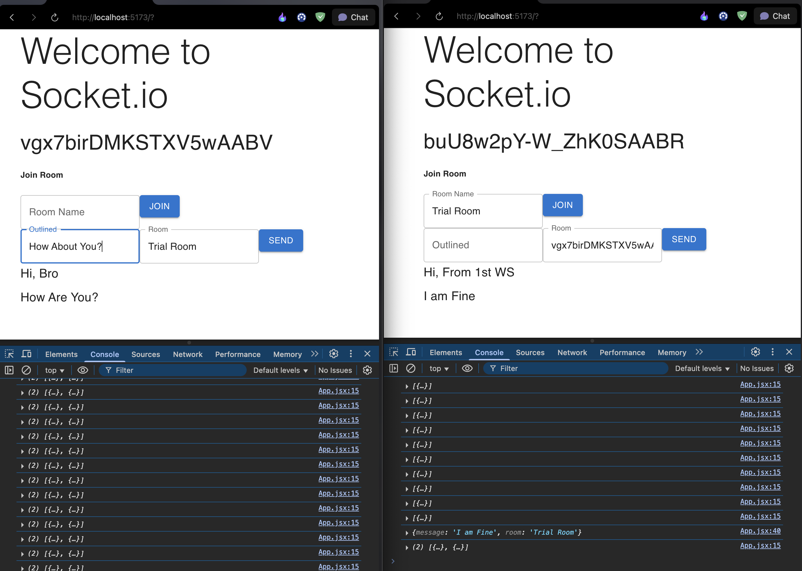

# Real-Time Chat Application with Socket.IO

A modern real-time chat application built with React and Node.js, featuring Socket.IO for instant messaging and room-based conversations.



## 🚀 Features

- **Real-time messaging** - Instant message delivery using WebSocket connections
- **Room-based chat** - Join specific chat rooms to organize conversations
- **Minimal UI** - Clean and responsive interface built with Material-UI
- **Socket connection management** - Automatic connection handling and user identification
- **Cross-platform** - Works on desktop and mobile browsers

## 🛠️ Tech Stack

### Frontend
- **React 19.1.0** - Modern React with hooks
- **Vite** - Fast build tool and development server
- **Material-UI** - Beautiful and accessible UI components
- **Socket.IO Client** - Real-time communication
- **Emotion** - CSS-in-JS styling

### Backend
- **Node.js** - JavaScript runtime
- **Express.js** - Web application framework
- **Socket.IO** - Real-time bidirectional communication
- **CORS** - Cross-origin resource sharing

## 📁 Project Structure

```
chatAppSocket/
├── client/                 # React frontend application
│   ├── src/
│   │   ├── App.jsx        # Main application component
│   │   └── main.jsx       # Application entry point
│   ├── public/            # Static assets
│   ├── package.json       # Frontend dependencies
│   └── vite.config.js     # Vite configuration
├── server/                # Node.js backend
│   ├── app.js            # Express server with Socket.IO
│   └── package.json      # Backend dependencies
└── README.md             # This file
```

## 🚦 Getting Started

### Prerequisites

- Node.js (v14 or higher)
- npm or yarn package manager

### Installation

1. **Clone the repository**
   ```bash
   git clone <repository-url>
   cd chatAppSocket
   ```

2. **Install server dependencies**
   ```bash
   cd server
   npm install
   ```

3. **Install client dependencies**
   ```bash
   cd ../client
   npm install
   ```

### Running the Application

1. **Start the backend server**
   ```bash
   cd server
   npm run dev
   ```
   The server will start on `http://localhost:3000`

2. **Start the frontend application** (in a new terminal)
   ```bash
   cd client
   npm run dev
   ```
   The client will start on `http://localhost:5173`

3. **Open your browser** and navigate to `http://localhost:5173`

## 🎮 How to Use

1. **Connect to the chat** - The application automatically connects you to the server
2. **Join a room** - Enter a room name and click "Join" to join a specific chat room
3. **Send messages** - Type your message and specify the room, then click "Send"
4. **Real-time updates** - See messages from other users in real-time

## 🔧 Available Scripts

### Server
- `npm start` - Start the production server
- `npm run dev` - Start the development server with nodemon

### Client
- `npm run dev` - Start the development server
- `npm run build` - Build for production
- `npm run preview` - Preview the production build
- `npm run lint` - Run ESLint

## 🌐 API Endpoints

### Socket.IO Events

#### Client to Server
- `message` - Send a message to a specific room
  ```javascript
  socket.emit('message', { message: 'Hello!', room: 'general' })
  ```
- `join-room` - Join a chat room
  ```javascript
  socket.emit('join-room', 'roomName')
  ```

#### Server to Client
- `connect` - Fired when client connects
- `received-message` - Receive messages from the room
- `welcome` - Welcome message (commented out in current version)

## 🔒 CORS Configuration

The application is configured to allow connections from:
- Frontend: `http://localhost:5173`
- Methods: `GET`, `POST`
- Credentials: Enabled

## 🚀 Deployment

### Backend Deployment
1. Set environment variables for production
2. Update CORS origins to match your frontend domain
3. Deploy to your preferred hosting service (Heroku, Railway, etc.)

### Frontend Deployment
1. Update the Socket.IO server URL in `App.jsx`
2. Build the application: `npm run build`
3. Deploy the `dist` folder to your hosting service (Vercel, Netlify, etc.)

## 🤝 Contributing

1. Fork the repository
2. Create a feature branch (`git checkout -b feature/amazing-feature`)
3. Commit your changes (`git commit -m 'Add some amazing feature'`)
4. Push to the branch (`git push origin feature/amazing-feature`)
5. Open a Pull Request

## 📝 License

This project is open source and available under the [ISC License](LICENSE).

## 🐛 Known Issues

- Messages are not persisted (they disappear on page refresh)
- No user authentication or user names
- No message history

## 🔮 Future Enhancements

- [ ] User authentication and profiles
- [ ] Message persistence with database
- [ ] Private messaging
- [ ] File sharing capabilities
- [ ] Typing indicators
- [ ] Online user list
- [ ] Message timestamps
- [ ] Emoji support
- [ ] Message reactions

## 📞 Support

If you have any questions or need help, please open an issue in the repository.

---

Made with ❤️ using React and Socket.IO